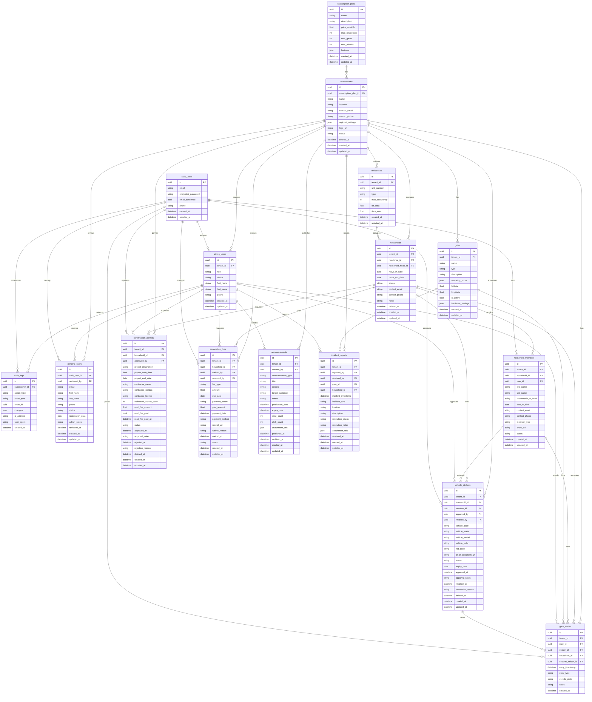

# Village Tech - HOA Management Platform Database ERD

## Overview
This is a comprehensive Entity Relationship Diagram (ERD) for the Village Tech HOA Management Platform - a multi-tenant system designed to manage residential communities, their residents, facilities, and administrative operations.

## Database Architecture

The system follows a **multi-tenant architecture** where:
- **Tenants** = Residential Communities
- **Row-Level Security (RLS)** ensures data isolation between communities
- **Cascade Deletes** maintain data integrity
- **Soft Deletes** preserve historical data where needed

## Mermaid ERD Diagram

## Table Descriptions

### Core Platform Tables

#### 1. **subscription_plans**
Defines available subscription tiers for communities with limits on residences, gates, and admin users.

#### 2. **communities**
Main tenant entity representing residential communities/ HOAs with multi-tenancy support.

#### 3. **admin_users**
Community administrators with roles: superadmin, admin_head, admin_officer.

#### 4. **audit_logs**
Comprehensive audit trail of all administrative actions across the platform.

### Community Infrastructure

#### 5. **residences**
Individual housing units within communities (apartments, houses, condos, etc.).

#### 6. **gates**
Community access points with GPS coordinates and operating hours.

### Household Management

#### 7. **households**
Occupancy records linking households to specific residences with contact information.

#### 8. **household_members**
Individual residents with relationship types and contact details.

#### 9. **vehicle_stickers**
Vehicle authorization system with RFID integration and document management.

### Operations Management

#### 10. **construction_permits**
Home improvement permit system with contractor management and fee tracking.

#### 11. **association_fees**
HOA dues management with payment tracking and waiver support. Features enhanced payment processing with proper tenant isolation through household relationships, comprehensive debugging, and JWT-based authentication integration.

#### 12. **announcements**
Community communication system with targeted audiences and scheduling.

#### 13. **gate_entries**
Access control logs for security monitoring and reporting.

#### 14. **incident_reports**
Security incident management with resolution tracking.

#### 15. **pending_users**
Registration queue for new users awaiting admin approval.

## Key Features

### Multi-Tenancy
- Row-Level Security (RLS) on all tables
- Tenant isolation via `tenant_id` foreign keys
- Cascade deletes maintain data integrity

### Data Integrity
- Unique constraints on critical fields
- Foreign key relationships with proper cascading
- Soft deletes for historical preservation

### Security
- Integration with Supabase Auth system
- Role-based access control
- Comprehensive audit logging
- Pending user approval workflow

### Performance
- Optimized indexes on frequently queried fields
- Materialized views for analytics
- Efficient relationship patterns

## Database Views & Functions

### Analytics Views
- `household_stats` - Occupancy metrics
- `sticker_dashboard` - Vehicle sticker statistics
- `fee_summary` - Financial reporting
- `community_stats` - Platform overview

### RPC Functions

#### Community Management
- `suspend_community(community_id)` - Suspend a community
- `reactivate_community(community_id)` - Reactivate a suspended community
- `soft_delete_community(community_id)` - Soft delete a community

#### Payment Processing
- `record_fee_payment(fee_id, amount, payment_date, payment_method)` - Record association fee payments with proper tenant isolation through household relationship

#### Bulk Operations
- `approve_sticker_bulk(sticker_ids, expiry_date)` - Bulk approve vehicle stickers
- `revoke_sticker(sticker_id, reason)` - Revoke vehicle stickers

#### Security Operations
- User management and access control
- Audit trail maintenance

### Recent Database Enhancements (2025-10-17)

#### Fixed Association Fees Payment System
- **Enhanced RPC Function**: Updated `record_fee_payment` with proper household-tenant relationship JOIN logic
- **Fixed RLS Policies**: Updated Row Level Security policies to use household-tenant relationship instead of direct tenant_id comparison
- **JWT Token Handling**: Fixed tenant_id extraction from JWT `app_metadata` field
- **Enhanced Debugging**: Added comprehensive error reporting and debugging information

#### Applied Migrations
- `20251017000003_fix_record_fee_payment_household_join.sql` - Fixed RPC function with household-tenant JOIN logic
- `20251017000004_fix_association_fees_rls_policy.sql` - Updated RLS policies for proper household relationship
- `20251017000005_force_recreate_record_fee_payment.sql` - Force recreated RPC function with enhanced debugging
- `20251017000006_fix_jwt_tenant_extraction.sql` - Fixed JWT tenant_id extraction from app_metadata

#### Security Improvements
- **Proper Tenant Isolation**: Association fees now properly isolated through household relationships
- **Enhanced Error Messages**: Detailed debugging information for troubleshooting payment issues
- **Improved Authentication**: Correct JWT token parsing for tenant identification

#### Database Consistency
- **Relationship Integrity**: All tenant-based operations now use proper household-tenant relationships
- **Data Validation**: Enhanced validation for payment processing and fee management
- **Audit Compliance**: Comprehensive logging of all payment operations

This ERD represents a complete, production-ready HOA management system designed for scalability, security, and comprehensive community administration. The recent updates ensure proper tenant isolation and enhanced payment processing capabilities.